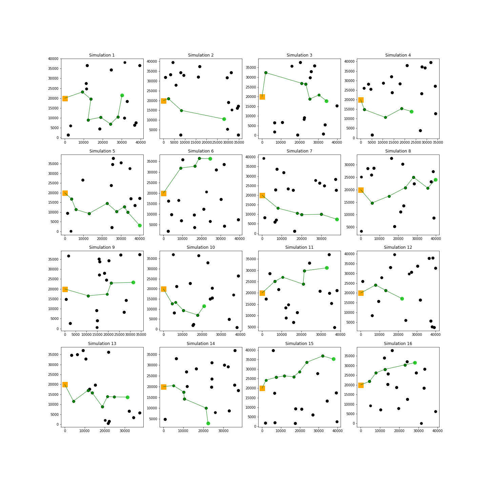
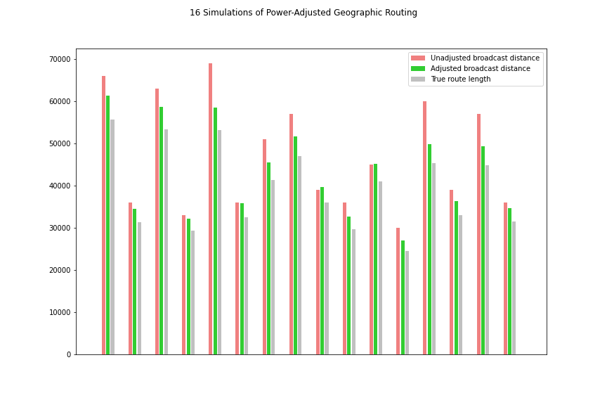

# WirelessSensorNetwork_CLD
This repository contains an outline and simulation of an original cross-layer design for a wireless sensor network, with the goal of maximising energy efficiency and increasing network lifetime. An explanation of the design can be found in the document `Cross_Layer_WSN_design_report`, and a Google Colabatory simulation is contained in the file `ELEC5514_final_report_simulation.ipynb` [best viewed/run on Google Colab](https://colab.research.google.com/github/babsyco/WirelessSensorNetwork_CLD/blob/main/ELEC5514_final_report_simulation.ipynb)). 

### Visualisations (produced in `ELEC5514_final_report_simulation.ipynb`): 

#### 16-round simulation:

#### Gains in transmission distance:

